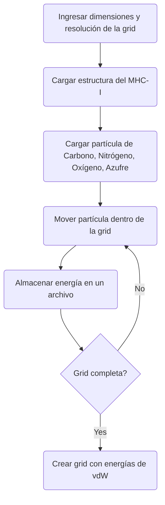
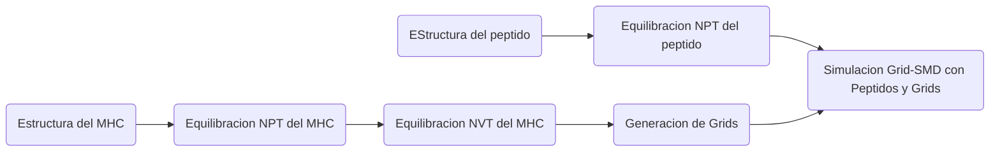

test

Crear una grid de vdW(vdW-Grid)

```mermaid
flowchart TD;
    A(Ingresar dimensiones y resolución de la grid)-->B(Cargar estructura del MHC-I);
    B(Cargar estructura del MHC-I)-->C(Cargar partícula de Carbono, Nitrógeno, Oxígeno, Azufre);
    C(Cargar partícula de Carbono, Nitrógeno, Oxígeno, Azufre)-->D(Mover partícula dentro de la grid);
    D(Calcular energía de van der Waals)-->E(Almacenar energía en un archivo);
    E(Almacenar energía en un archivo)-->F{Grid completa?};
    F{Grid completa?}-->|Yes|G(Crear grid con energías de vdW);
    F{Grid completa?}-->|No|D(Mover partícula dentro de la grid);
```

Realizar simulaciones peptido-MHC con vdW-Grids

```mermaid
flowchart LR;
    A(Estructura del MHC)-->B(Equilibracion NPT del MHC)-->C(Equilibracion NVT del MHC)-->D(Generacion de Grids);
    E(EStructura del peptido)-->F(Equilibracion NPT del peptido)-->G(Simulacion Grid-SMD con Peptidos y Grids)
    D(Generacion de Grids)-->G(Simulacion Grid-SMD con Peptidos y Grids)
```
